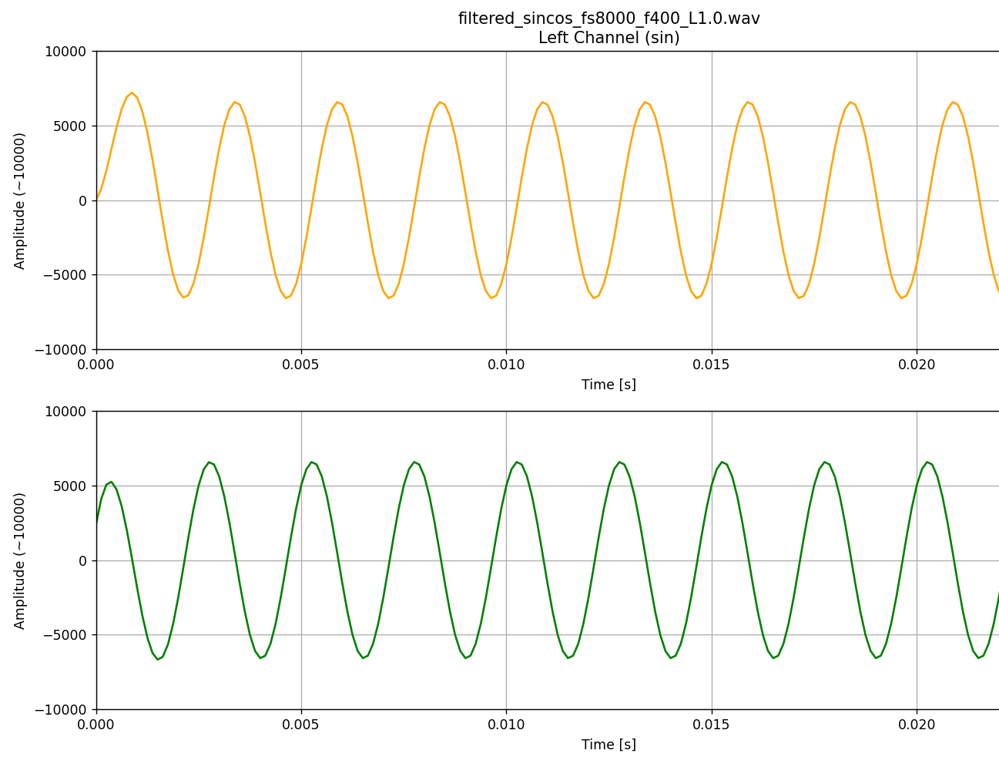

# 數位訊號處理作業1
### 學號:711481109 姓名:莊祐儒
---
作業包含多個手寫數學的掃描檔與數位版本，以及Problem 7的程式碼實現與分析。

---

## **手寫作業 (Problems 1-6)**
此部分包含多個手寫圖檔以及以LaTeX方法來編寫的算式

###  Problem 1 - 手寫


###  Problem 1 - LaTeX

微分方程推導
根據 KVL（Kirchhoff 電壓定律）：
$$x(t) = R \cdot I(t) + y(t)$$  

又因為 $I(t) = C \frac{dy(t)}{dt}$

代入得到：
$$x(t) = RC \frac{dy(t)}{dt} + y(t)$$  

---

頻率響應
對上式進行傅立葉轉換：
$$X(\Omega) = Y(\Omega)(1 + j\Omega RC)$$ 

因此：
$$H(\Omega) = \frac{Y(\Omega)}{X(\Omega)} = \frac{1}{1 + j\Omega RC}$$  

---

穩態輸出
若輸入為 $x(t) = e^{j\Omega t}$，則輸出為：

$$y(t) = e^{j\Omega t} \cdot \frac{1}{1 + j\Omega RC}$$  


###  Problem 2 - 手寫


###  Problem 2 - LaTeX

Given
* Input signal: $x(t) = e^{j\Omega t} u(t)$  
* System time constant: $\tau = RC$  

---

Step 1: Laplace Transform

將輸入與系統函數轉換到 s-domain：

$$
X(s) = \frac{1}{s - j\Omega}, \quad
H(s) = \frac{1}{1 + \tau s}
$$


---

Step 2: Output in s-domain

輸出為輸入與系統函數的乘積：

$$
Y(s) = X(s) \cdot H(s) = \frac{1}{\tau} \cdot \frac{1}{s - j\Omega} \cdot \frac{1}{s + 1/\tau}
$$

---

Step 3: Partial Fraction Expansion (PFE)

將 $Y(s)$ 拆成兩個簡單分數：

$$
Y(s) = \frac{1}{\tau} \left( \frac{A}{s - j\Omega} + \frac{B}{s + 1/\tau} \right)
$$

係數：

$$A = \frac{\tau}{1 + j\Omega \tau}, \quad$$
$$B = -\frac{\tau}{1 + j\Omega \tau}$$

代回：

$$Y(s) = \frac{1}{1 + j\Omega \tau} \cdot \frac{1}{s - j\Omega} - \frac{1}{1 + j\Omega \tau} \cdot \frac{1}{s + 1/\tau}$$


---

Step 4: Inverse Laplace Transform

將每項反 Laplace：

$$y(t) = \frac{1}{1 + j\Omega RC} e^{j\Omega t} - \frac{1}{1 + j\Omega RC} e^{-t/RC}, \quad t \ge 0$$


Step 5: Steady-State and Transient Response

- Steady-State Response (穩態解)
  
$$y_{ss}(t) = \frac{1}{1 + j\Omega RC} e^{j\Omega t}$$


- Transient Response (暫態解)

$$y_{tr}(t) = - \frac{1}{1 + j\Omega RC} e^{-t/RC}$$


###  Problem 3 - 手寫


###  Problem 3 - LaTeX

System Definition and Parameters
 設定輸入 $x(t) = e^{j\omega t}$  
 
 設定 RC 元件參數 $R$ 與 $C$  
 
 計算角頻率 $\omega = 2\pi f$  

Transfer Function
 計算 RC 低通濾波器傳遞函數：
 
 $$H(\omega) = \frac{1}{1 + RC j \omega}$$
 
 預計算 $RC\omega = f/400$  

---

Case 1: $f = 100$ Hz
計算傳遞函數：

 $$
 H(\Omega) = \frac{1}{1 + j0.25} = \frac{16}{17} - j\frac{4}{17}
 $$
 
計算幅值與相位：
 
 $$
 |H| \approx 0.970, \quad \angle H \approx -14.04^\circ
 $$
 
計算輸出信號：

 $$
 y(t) \approx 0.970 e^{j(200\pi t - 14.04^\circ)}
 $$

---

Case 2: $f = 400$ Hz
計算傳遞函數：

 $$
 H(\Omega) = \frac{1}{1 + j} = \frac{1}{2} - j \frac{1}{2}
 $$
 
計算幅值與相位：

 $$
 |H| \approx 0.707, \quad \angle H = -45^\circ
 $$
 
計算輸出信號：

 $$
 y(t) \approx 0.707 e^{j(800\pi t - 45^\circ)}
 $$

---

Case 3: $f = 3000$ Hz
計算傳遞函數：

 $$
 H(\Omega) = \frac{1}{1 + j7.5} = \frac{4}{229} - j \frac{30}{229}
 $$
 
計算幅值與相位：

 $$
 |H| \approx 0.132, \quad \angle H \approx -82.41^\circ
 $$
 
計算輸出信號：

 $$
 y(t) \approx 0.132 e^{j(6000\pi t - 82.41^\circ)}
 $$


### Problem 4 - 手寫


### Problem 4 - LaTeX

System Definition and Parameters
 設定輸入 $x(t) = e^{j\Omega t}$  
 設定 RC 元件參數 $R = 1000 \, \Omega, \ C = \frac{1}{2\pi \cdot 400 \cdot 1000} \, F$  
 計算時間常數 $RC = \frac{1}{800\pi}$  

總輸出方程式：

 $$
 y(t) = \frac{1}{1+j\Omega RC} (e^{j\Omega t} - e^{-t/RC}), \quad t \ge 0
 $$

---

Case 1: $f = 100$ Hz
 計算角頻率：

 $$
 \Omega = 2\pi f = 2\pi (100) = 200\pi \, \text{rad/s}
 $$
 
 計算傳遞函數：

 $$
 1+j\Omega RC = 1 + j(200\pi)\left(\frac{1}{800\pi}\right) = 1 + j\frac{1}{4} = 1.031 e^{j14.04^\circ}
 $$
 $$
 \frac{1}{1+j\Omega RC} \approx 0.970 e^{-j14.04^\circ}
 $$
 
 計算輸出信號：

 $$
 y(t) \approx 0.970 e^{-j14.04^\circ} (e^{j200\pi t} - e^{-800\pi t})
 $$

---

Case 2: $f = 400$ Hz
 計算角頻率：

 $$
 \Omega = 2\pi f = 2\pi (400) = 800\pi \, \text{rad/s}
 $$
 
 計算傳遞函數：

 $$
 1+j\Omega RC = 1 + j(800\pi)\left(\frac{1}{800\pi}\right) = 1 + j1 = \sqrt{2} e^{j45^\circ} \approx 1.414 e^{j45^\circ}
 $$
 $$
 \frac{1}{1+j\Omega RC} \approx 0.707 e^{-j45^\circ}
 $$
 
 計算輸出信號：

 $$
 y(t) \approx 0.707 e^{-j45^\circ} (e^{j800\pi t} - e^{-800\pi t})
 $$

---

Case 3: $f = 3000$ Hz
 計算角頻率：

 $$
 \Omega = 2\pi f = 2\pi (3000) = 6000\pi \, \text{rad/s}
 $$
 
 計算傳遞函數：

 $$
 1+j\Omega RC = 1 + j(6000\pi)\left(\frac{1}{800\pi}\right) = 1 + j7.5 = 7.566 e^{j82.41^\circ}
 $$
 $$
 \frac{1}{1+j\Omega RC} \approx 0.132 e^{-j82.41^\circ}
 $$
 
 計算輸出信號：

 $$
 y(t) \approx 0.132 e^{-j82.41^\circ} (e^{j6000\pi t} - e^{-800\pi t})
 $$
 
###  Problem 5 - 手寫


###  Problem 5 - LaTeX

System Definition and Parameters
 設定差分方程：
 
 $$
 y[n] = \frac{RC}{R\tau+RC} y[n-1] + \frac{\tau}{R\tau+RC} x[n]
 $$
 
 計算 Z 轉換：
 
 $$
 Y(z) = \frac{RC}{R\tau+RC} z^{-1} Y(z) + \frac{\tau}{R\tau+RC} X(z)
 $$
 
 計算傳遞函數：
 
 $$
 H(z) = \frac{Y(z)}{X(z)} = \frac{\frac{\tau}{R\tau+RC}}{1 - \frac{RC}{R\tau+RC} z^{-1}} = \frac{\tau}{R\tau + RC - RC z^{-1}}
 $$

---

Transfer Function Simplification
 將分子分母同除以 $\tau$：

 $$
 H(z) = \frac{1}{R + \frac{RC}{\tau} (1 - z^{-1})}
 $$

 帶入 $RC = \frac{1}{800\pi}$：

 $$
 H(z) = \frac{1}{R + \frac{1}{800\pi \tau} (1 - z^{-1})}
 $$

---

Frequency Response
 計算頻率響應 $H(\omega) = H(z)\big|_{z = e^{j\omega}}$：

 $$
 H(\omega) = \frac{1}{R + \frac{1}{800\pi \tau} (1 - e^{-j\omega})} = \frac{1}{1 + \frac{1}{800\pi \tau} (1 - e^{-j\omega})}
 $$

---

Steady-State Response
 對輸入 $x[n] = e^{j\omega n}$，系統穩態響應為：

 $$
 y[n] = H(\omega) \cdot x[n] = \frac{1}{1 + \frac{1}{800\pi \tau} (1 - e^{-j\omega})} e^{j\omega n}
 $$

###  Problem 6 - 手寫


###  Problem 6 - LaTeX


System Transfer Function
 設定系統傳遞函數：
 
 $$
 H(z) = \frac{\tau}{\tau + RC (1-z^{-1})}
 $$

Input Signal Z-Transform
 輸入信號 Z 轉換：
 
 $$
 X(z) = \frac{1}{1 - e^{j\omega} z^{-1}}
 $$

---

Output Z-Transform and Partial Fraction Expansion:

 
 $$
 Y(z) = \underbrace{\frac{A}{1 - e^{j\omega} z^{-1}}}_{\text{穩態}} + \underbrace{\frac{B}{\tau + RC (1-z^{-1})}}_{\text{暫態}}
 $$

---

Coefficient Calculation

1. Steady-State Coefficient \(A\)

 $$
 A = Y(z) \cdot (1 - e^{j\omega} z^{-1}) \Big|_{z^{-1} = e^{-j\omega}} = H(e^{j\omega})
 $$
 $$
 A = \frac{\tau}{\tau + RC (1-e^{-j\omega})}
 $$

2. Transient Coefficient \(B\)


 $$
 B = X(z) \cdot \tau \Big|_{z^{-1} = 1+\frac{\tau}{RC}} 
 $$
 $$
 B = \frac{1}{1 - e^{j\omega} z^{-1}} \cdot \tau \Big|_{z^{-1} = 1+\frac{\tau}{RC}}
 $$
 $$
 B = \frac{\tau}{1 - e^{j\omega} (1+\frac{\tau}{RC})}
 $$

---

Final Response \(y[n]\)

將 Y(z) 的兩項進行 Z 反變換：

穩態部分：

$$
y_{ss}[n] = \frac{\tau}{\tau + RC (1-e^{-j\omega})} \, e^{j\omega n} \, u[n]
$$

暫態部分：

$$
y_{tr}[n] = \frac{1}{1 - e^{j\omega} (1+\frac{\tau}{RC})} \left( \frac{RC}{\tau+RC} \right)^n u[n]
$$

最終完整響應：

$$
y[n] = y_{ss}[n] + y_{tr}[n]
$$

###  Problem 7  RC電路低通濾波器(以C語言撰寫)

## 目錄

1.標頭與常數定義

2.WAV 檔案結構定義

3.檢查命令列參數

4.開啟與讀取 WAV 檔頭

5.讀取 PCM 音訊資料

6.從檔名解析濾波 cutoff frequency

7.設定 RC 濾波參數

8.初始化濾波暫存

9.RC 低通濾波處理

10.寫出濾波後 WAV


---

## 1. 標頭與常數定義

```c
#include <stdio.h>
#include <math.h>
#include <memory.h>
#include <stdlib.h>
#include <string.h>
#define PI 3.14159265359
```

說明:
引入必要的標頭檔與常數：

- `stdio.h`, `stdlib.h`：檔案操作與動態記憶體分配。
- `math.h`：數學運算（例如 `round()`）。
- `string.h`：字串搜尋與擷取頻率。
- `PI`：供 RC 濾波公式使用。

## 2. WAV檔案結構定義

```c
typedef struct {
    char chunkID[4];     
    unsigned int chunkSize;
    char format[4];      
} RIFFHeader;

typedef struct {
    char subchunk1ID[4]; 
    unsigned int subchunk1Size; 
    unsigned short audioFormat; 
    unsigned short numChannels; 
    unsigned int sampleRate;    
    unsigned int byteRate;      
    unsigned short blockAlign;  
    unsigned short bitsPerSample;
} FmtSubchunk;

typedef struct {
    char subchunk2ID[4]; 
    unsigned int subchunk2Size;
} DataSubchunk;
```

說明：
這三個結構對應 WAV 檔案格式：

1. `RIFFHeader`：WAV 主標頭，包含 `"RIFF"` 與 `"WAVE"` 標誌。
2. `FmtSubchunk`：音訊格式資訊（取樣率、聲道數、位元深度等）。
3. `DataSubchunk`：音訊資料段標頭，描述資料長度。


## 3. 檢查命令列參數

```c
int main(int argc, char *argv[])
{
    if(argc != 3){
        printf("Usage: %s in_fn out_fn\n", argv[0]);
        return 1;
    }

    char *in_fn = argv[1];   
    char *out_fn = argv[2];  


```


說明：
確認執行時的輸入參數是否正確：

- `in_fn`：輸入 WAV 檔案名稱。
- `out_fn`：輸出 WAV 檔案名稱。
- 若參數不足，程式會提示正確使用方式後結束。


## 4. 開啟與讀取 WAV 檔頭
 
 ```c
    FILE *fp = fopen(in_fn, "rb");  // 以二進位模式開啟輸入 WAV
    if(!fp){
        fprintf(stderr, "Cannot open file %s\n", in_fn);
        return 1;
    }

    RIFFHeader riff;
    FmtSubchunk fmt;
    DataSubchunk data;

    fread(&riff, sizeof(RIFFHeader), 1, fp);
    fread(&fmt, sizeof(FmtSubchunk), 1, fp);
    fread(&data, sizeof(DataSubchunk), 1, fp);
```


說明：
以二進位模式開啟 WAV 檔案，依序讀取：

- RIFF 標頭：確認檔案格式。
- 格式資訊區（fmt chunk）。
- 音訊資料區（data chunk）標頭。


##  5. 讀取 PCM 音訊資料

```c
    int fs = fmt.sampleRate;
    int bitsPerSample = fmt.bitsPerSample;
    int numChannels = fmt.numChannels;
    size_t N = data.subchunk2Size / (numChannels * bitsPerSample / 8);

    short *stereo = malloc(N * fmt.numChannels * sizeof(short));
    fread(stereo, sizeof(short), N*fmt.numChannels, fp);
    fclose(fp);
```

說明：
從 fmt 區段中取得取樣率、通道數、位元深度。  
根據資料大小計算樣本數 `N`，並配置記憶體以讀取所有取樣。  
讀取完畢後關閉檔案。

## 7. 從檔名解析 cutoff frequency

```c
    int f = 0;  // cutoff frequency
    char *first_f = strchr(in_fn, 'f');
    if(first_f != NULL){
        char *second_f = strchr(first_f + 1, 'f');
        if(second_f != NULL){
            f = atoi(second_f + 1);
            printf("Extracted cutoff frequency f = %d Hz\n", f);
        }
    }
    if(f <= 0){
        fprintf(stderr, "Failed to extract cutoff frequency from filename.\n");
        return 1;
    }
```

說明：

透過字串搜尋函式 `strchr()` 找出第二個 `'f'` 之後的數字作為截止頻率。  
例如：輸入檔名 `"test_f400_in.wav"` → `f = 400 Hz`。  
若解析失敗則輸出錯誤訊息並結束。


## 8. 設定 RC 濾波參數

```c
    double T = 1.0/fs;   // 取樣週期
    double R = 1000;     
    double C = 1.0/(2*PI*f*1000);  // cutoff frequency 自動使用 f
    double a = R*C/(R*C+T);
```

說明：
設定 RC 濾波器參數：

- `T`：取樣週期 (1/fs)。
- `R`：電阻（固定 1kΩ）。
- `C`：依頻率計算電容值。
- `a`：離散化濾波係數。

## 9. 初始化濾波暫存

```c
    double out_l = 0, out_r = 0;
    size_t total_samples = data.subchunk2Size / (numChannels * bitsPerSample / 8);
```


說明：
初始化濾波暫存與計算總取樣數：

- `out_l`, `out_r`：左右聲道的上一個輸出值，用於一階 RC 濾波計算。
- `total_samples`：總取樣數 (每個通道的樣本數)，用於迴圈處理整個音訊資料。


## 10. RC 低通濾波處理

```c
    for (size_t n = 0; n < total_samples; n+=2){
        double in_L = stereo[n];       
        double in_R = stereo[n+1];     

        out_l = (1-a) * in_L + a * out_l;
        out_r = (1-a) * in_R + a * out_r;

        stereo[n] = (short)round(out_l);
        stereo[n+1] = (short)round(out_r);

        // 限幅避免溢位
        if (stereo[n] > 32767) stereo[n] = 32767;
        if (stereo[n] < -32768) stereo[n] = -32768;
        if (stereo[n+1] > 32767) stereo[n+1] = 32767;
        if (stereo[n+1] < -32768) stereo[n+1] = -32768;
    }

```
說明：
RC 低通濾波處理迴圈：

- 使用 `for` 迴圈逐樣本處理左右聲道 (`n+=2` 遍歷 stereo array)。
- `in_L`、`in_R`：當前左右聲道輸入樣本。
- RC 濾波公式：
- `out_l = (1-a) * in_L + a * out_l;`
  `out_r = (1-a) * in_R + a * out_r;`


其中 `a` 控制平滑程度，上一個輸出影響下一個輸出。
- 將濾波後結果回寫到 `stereo` 陣列，使用 `round()` 並轉型為 `short`。
- 限幅 (clipping)：確保輸出值不超過 16-bit PCM 的範圍 [-32768, 32767]，避免溢位。


## 11. 寫出濾波後 WAV

```c
    fp = fopen(out_fn, "wb");
    if(!fp){ fprintf(stderr, "Cannot save %s\n", out_fn); exit(1); }

    fwrite(&riff, sizeof(RIFFHeader), 1, fp);
    fwrite(&fmt, sizeof(FmtSubchunk), 1, fp);
    fwrite(&data, sizeof(DataSubchunk), 1, fp);
    fwrite(stereo, sizeof(short), N*fmt.numChannels, fp);

    free(stereo);
    fclose(fp);

    return 0;
}
```

說明：
寫出濾波後的 WAV 檔案：

- `fopen(out_fn, "wb")`：以二進位寫入模式開啟輸出檔案。
- 若開檔失敗，輸出錯誤訊息並結束程式。
- `fwrite`：
  - 先寫入 `RIFFHeader`、`FmtSubchunk`、`DataSubchunk` 標頭。
  - 再寫入濾波後的 PCM 音訊資料 `stereo`。
- 釋放動態配置的記憶體 `free(stereo)`。
- 關閉檔案 `fclose(fp)`。
- 程式結束 `return 0;`。


### **濾波結果**

以下圖表展示了輸入的 sine/cosine wave（濾波前）和經過 RC 低通濾波器處理後（濾波後）的波形。

#### fs:4000Hz f:100Hz
| 濾波前波形圖 | 濾波後波形圖 |
| :---: | :---: |
|  |  |
---

#### fs:4000Hz f:400Hz
| 濾波前波形圖 | 濾波後波形圖 |
| :---: | :---: |
|  |  |
---

#### fs:4000Hz f:3000Hz
| 濾波前波形圖 | 濾波後波形圖 |
| :---: | :---: |
|  |  |
---

#### fs:8000Hz f:100Hz
| 濾波前波形圖 | 濾波後波形圖 |
| :---: | :---: |
|  |  |
---

#### fs:8000Hz f:400Hz
| 濾波前波形圖 | 濾波後波形圖 |
| :---: | :---: |
|  |  |
---

#### fs:8000Hz f:3000Hz
| 濾波前波形圖 | 濾波後波形圖 |
| :---: | :---: |
|  |  |
---

#### fs:16000Hz f:100Hz
| 濾波前波形圖 | 濾波後波形圖 |
| :---: | :---: |
|  |  |
---

#### fs:16000Hz f:400Hz
| 濾波前波形圖 | 濾波後波形圖 |
| :---: | :---: |
|  |  |
---

#### fs:16000Hz f:3000Hz
| 濾波前波形圖 | 濾波後波形圖 |
| :---: | :---: |
|  |  |
---

## 濾波結果比較

將輸入信號經過RC低通濾波器後，可以觀察到以下特性：  
- **振幅變化**：頻率低於截止頻率的成分幾乎保持原始大小，而高於截止頻率的成分會逐漸衰減。  
- **相位變化**：隨著頻率升高，輸出信號相對輸入信號會出現延遲，高頻成分的相位延遲更加明顯。


## Problem 7：振幅 & 相位分析 

### RC 一階低通濾波器基本公式與直觀說明

對於一階連續時間 RC 低通濾波器：

$$
H(\Omega) = \frac{1}{1 + j \Omega RC}
$$

- **幅度（線性）**：

$$
|H(\Omega)| = \frac{1}{\sqrt{1 + (\Omega RC)^2}}
$$

- **幅度（dB）**：

$$
20 \log_{10} |H(\Omega)|
$$

- **相位**：

$$
\angle H(\Omega) = - \tan^{-1}(\Omega RC)
$$

---

### -3 dB 的意義

- **定義**：輸出能量減少一半（功率下降 50%），對應幅值變為原來的 \$\frac{1}{\sqrt{2}} \approx 0.707\$。
- **數學公式**：

$$
|H(\Omega_c)| = \frac{1}{\sqrt{2}} \implies \Omega_c = \frac{1}{RC}
$$

- **對應 dB**：

$$
20 \log_{10}\left(\frac{1}{\sqrt{2}}\right) \approx -3.01 \text{ dB}
$$

- **實務說明**：  
  -3 dB 通常作為「截止頻率」的定義，在該頻率下，輸出幅度降至 0.707，且相位為 \$-45^\circ\$。

---

## Problems 1–6：Analog vs Discrete 差異總結

以下以「動作 → 影響」方式說明各題重點，聚焦在穩態幅度/相位與暫態差異。

### Problem 1（連續時間微分方程 → 連續 \(H(Omega)\)）

- **動作**：由微分方程推導出 

$$
H(\Omega) = \frac{1}{1 + j \Omega RC}
$$

- **影響**：得到真實類比的幅相特性（理想一階低通），可直接得出 \$\Omega_c = \frac{1}{RC}\$。


---

### Problem 2（Laplace 分析，複數指數輸入）

- **動作**：在 s 平面進行部分分式分解，求得穩態與暫態成分：  
  - 穩態： \$\$H(j\Omega)e^{j\Omega t}\$\$
  - 暫態：指數衰減項
- **影響**：形式與 Problem 1 相同，但強調暫態項存在（極點對應時間常數 RC）。  
  穩態幅相由連續 \$H(j\Omega)\$決定。

---

### Problem 3（數值例子：f = 100、400、3000 Hz）

- **動作**：代入 \$H(\Omega)\$ 計算數值幅相（例如 0.970 / 0.707 / 0.132）。
- **影響**：提供直觀比較，顯示低頻通過、高頻衰減，且在截止頻率（400 Hz）時對應 -3 dB 及 −45° 相位。

---

### Problem 4（輸入有暫態： \$\$e^{j\Omega t}\$\$ + 初始條件）

- **動作**：總響應包含穩態項 \$e^{j\Omega t}\$ 以及暫態指數項。
- **影響**：暫態造成輸出在初期偏離穩態，隨時間衰減後趨近 Problem 1 的結果。  
  若在暫態期間觀測，幅相測量會出現誤差。

---

### Problem 5（離散化、差分方程理論）

- **動作**：採用後向歐拉法（Backward Euler）離散化，得到差分係數 \(a, b\)，  
  並推導離散頻率響應：

$$
H_d(e^{j\omega}) = \frac{b}{1 - a e^{-j\omega}}
$$

- **影響**：離散化會引入數值誤差與阻尼效應。  
  若取樣週期 \(T\) 足夠小（取樣頻率 fs 高），則 

$$
H_d(e^{j\omega}) \approx H(j\Omega) \quad (\Omega = \omega/T)
$$

  若 fs 不夠高或方法粗略，誤差顯著。  
  後向歐拉法相較於理想 ZOH，有較強的高頻衰減。

---

### Problem 6（離散時間 Z 轉換與部分分式）

- **動作**：使用 Z 轉換與部分分式展開，求得離散系統的穩態與暫態響應。  
  - 穩態由 \$H(e^{j\omega})\$ 決定
- **影響**：形式與連續時間相似，但係數受到取樣週期 \$\tau\$ 影響。  
  暫態項以離散指數 \$(\text{pole})^n\$ 衰減。  
  高頻段的相位與群延遲可能與類比系統不同，且可能發生折疊或混疊現象（若輸入 x[n] 非帶限信號）。

